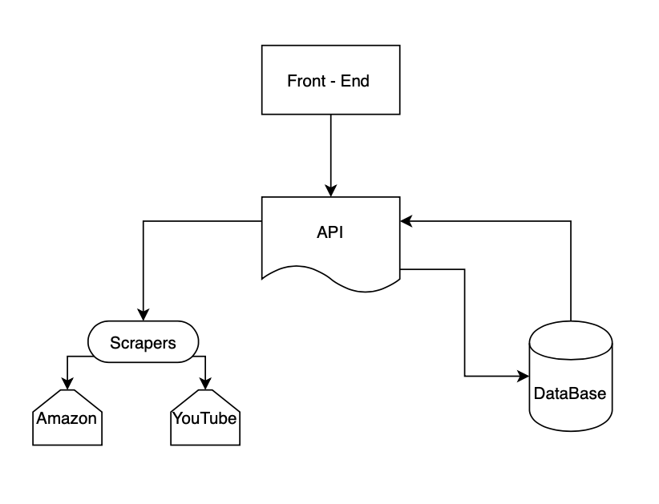

***The documentation  in this repository describe the FullStack webscrapping platform for use in Machine learning.***

### Architecture 



We first break the architecture into four distictive components namely Front-End, API, Scrapers and Database. The user sends information from the front-end to the API, the fron-end connects the API through a form. Inputs like the youtube URL are sent through front-end. Later the scrapers through the API pulls the necessary data and is saved to the database. Afterwhich the data is served to the front-end.

The Tech Stack are as below 

1. Front-End - javascript
2. API - express
3. scraper - puppeteer
4. db - mysql (typeorm)

Also we need nodejs, npm and mysql.

The Architecture consists of several components:

#### Front End
For the Front-end we will have a header, an input box and a button. Below which we will have render boxes which renders relevant info from json. This will send data to the API.

#### API
We will have to create a single route with two methods GET and POST. We use nodejs and simple backed framework express. 


#### Scraper 
This function takes in URL and reaches out to YouTube, fetch the relevant data and then store it into the database.

#### Database
We use mySQL here. Here we add id, name, avatar and channelURL


To run the program 

First go into server

```
$ npm install init
```

Install all the necessary packages

```
$ npm install express
$ npm install body-parser
```
Run the index.js script

```
$ node index.js
```

Thanks to Aron from Uber 